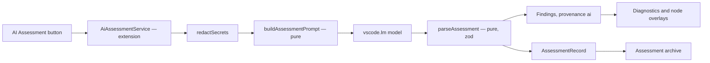

# AI Assessment

Plan for the *AI assessment* feature.

**Status: implemented.** `src/assessment/` holds the pure core, `src/extension/ai-assessment.ts`
the host service, and the `AI Assessment` button ships in the graph panel toolbar.

> If Copilot is authenticated in the same VSCode the Skill Insights runs, provide button `AI Assessment`:
>
> - user will be notified about consumption of AI using GH Copilot
> - when clicked the selected skill will be assessed by AI and default model
> - findings from AI will be recorded in the same way
> - summary report will be kept in internal Skill Insights database as well

## 1. Intent

Deterministic rules cover structure, references, and permissions. They cannot judge whether a
condition is ambiguous, whether a failure path is missing, or whether the description matches
what the body actually does. An AI pass covers that semantic layer and reports it through the
existing finding pipeline, so the user sees one consistent result surface.

**Goals**

- One explicit, user-initiated action that assesses the currently selected skill.
- AI findings render on blocks and in the Problems panel exactly like rule findings.
- Each run leaves a durable summary report in a local Skill Insights store.
- Zero behaviour change when no model is available — the feature degrades, nothing breaks.

**Non-goals**

- No automatic assessment on open, save, or keystroke.
- No AI participation in CI, `vss lint`, or any snapshot-gated path.
- No bundled model, no direct network client, no API key handling of our own.

## 2. Naming

The chat command is `/skillinsights-review`, not `/review`. `/review` is already taken by other
participants and by user skills, and a collision makes the command ambiguous in the picker.

| Surface | Identifier |
| --- | --- |
| Chat command | `@skillInsights /skillinsights-review` |
| Command palette | `Skill Insights: AI Assessment` (`skillInsights.aiAssessment`) |
| Panel button | `AI Assessment` |
| Finding namespace | `ai/*` |

## 3. Model access

VS Code's Language Model API is provider-neutral. Copilot Chat registers as `vendor: 'copilot'`;
Anthropic/Claude and other BYOK extensions register through the same provider contribution, so a
single call covers both cases in the issue.

```ts
const models = await vscode.lm.selectChatModels()          // [] = unavailable
```

**Default model selection**

1. In chat, use `request.model` — the model the user already picked in the chat picker.
2. From the button, take the first entry of `selectChatModels({ vendor: 'copilot' })`,
   falling back to `selectChatModels()` so a Claude-only setup still works.
3. `skillInsights.aiAssessment.model` (optional setting) overrides by family when set.

**Availability states**

| State | Cause | Behaviour |
| --- | --- | --- |
| `unavailable` | `selectChatModels()` returns `[]` | Button disabled with tooltip "Sign in to GitHub Copilot to enable AI assessment" |
| `needsConsent` | `LanguageModelError.NoPermissions` | VS Code's own consent dialog; on refusal we show a dismissible notice and stop |
| `blocked` | quota / rate limit (`LanguageModelError.Blocked`) | Error notification, no findings written, previous findings retained |
| `ready` | at least one model | Button enabled |

`vscode.lm.onDidChangeChatModels` re-evaluates availability, so signing in mid-session enables the
button without a reload. `engines.vscode` is already `^1.103.0`, and the API works in the web
extension host, so no host constraint is introduced.

## 4. Architecture

A model call is async, non-deterministic I/O. It therefore cannot be a `Rule` — `src/validation/types.ts`
requires rules to be pure and `RuleRegistry.run` is synchronous. Adding one there would break the
`fixtures/clean` zero-finding anchor, the `preview-build` graph snapshot, and CI reproducibility.

Instead a new layer sits beside validation, depending only on `ir`:

```text
extension  ->  editor  ->  assessment / validation / emitters  ->  parsers  ->  ir
```



### New: `src/assessment/`

Pure, environment-free, testable without a `vscode` double (which does not exist yet — GH issue #5).

```ts
export interface ModelClient {
  readonly id: string
  readonly vendor: string
  readonly family: string
  complete(prompt: AssessmentPrompt, signal: AbortSignal): Promise<string>
}

export interface AssessmentResult {
  readonly findings: readonly Finding[]
  readonly summary: string
  readonly rejected: number          // model findings dropped by validation
}

export function buildAssessmentPrompt(graph: SkillGraph): AssessmentPrompt
export function parseAssessment(graph: SkillGraph, raw: string): AssessmentResult
export function redactSecrets(graph: SkillGraph): { graph: SkillGraph; redactions: number }
```

The extension layer holds only the thin `vscode.lm` adapter, the consent notice, and the archive
implementation. Everything with logic worth testing stays in core.

### Changed: `Finding`

One field added to `findingSchema` in `src/ir/findings.ts`:

```ts
provenance: z.enum(['rule', 'ai']).optional()
```

Optional rather than defaulted, so every existing rule keeps constructing findings unchanged and an
absent value simply means `rule`. AI findings additionally carry an `ai/<category>` rule id, so the
sort order in `sortFindings` stays total without a new tiebreaker.

## 5. Consent and cost notification

Two distinct things, both required:

1. **VS Code's consent** — raised by the platform on the first `sendRequest` for this extension.
   We do not bypass it, and refusal is a terminal state for the run.
2. **Our usage notice** — a one-time modal shown before the first request:

   > AI Assessment sends this skill's content to GitHub Copilot and consumes your Copilot
   > allowance. Content is redacted for secrets before sending. Continue?
   >
   > `[Run assessment]` `[Don't ask again]` `[Cancel]`

   The acknowledgement is stored in `context.globalState` under
   `skillInsights.aiAssessment.acknowledged`. `Skill Insights: Reset AI Assessment Consent`
   clears it.

Progress uses `vscode.window.withProgress` on the notification location, cancellable, wired to the
`CancellationToken` passed into `sendRequest`.

## 6. UI

### Button

Added to the graph panel toolbar in `src/app/SkillEditor.tsx`, in `.vss-toolbar-actions` beside
undo/redo, as a labelled button (icon plus text — it is a costly action and should not be a bare
glyph).

```tsx
<button
  type="button"
  className="vss-ai-assessment"
  disabled={assessment.state !== 'ready'}
  aria-label="Run AI assessment of this skill"
  title={assessmentTooltip(assessment)}
  onClick={() => onRunAssessment?.()}
>
  <Sparkles size={15} />AI Assessment
</button>
```

New optional props keep the component usable standalone: `assessment?: AssessmentUiState` and
`onRunAssessment?: () => void`. `AssessmentUiState` is
`{ state: 'unavailable' | 'ready' | 'running' | 'error'; modelLabel?: string; message?: string; lastRunAt?: string; summary?: string }`.

While running: button shows a spinner, is `aria-busy`, and the label reads `Assessing…`.

### Results

- Findings are merged into the same arrays the editor already renders, so node badges, the
  inspector findings list, and source navigation work unchanged.
- AI findings carry a distinct visual marker (sparkle icon plus an "AI" chip) so a suggestion is
  never mistaken for a verified check.
- The returned summary renders in a collapsible `AI summary` section under the inspector, reusing
  `MarkdownPreview`.

### Message protocol

`src/editor/messages.ts` gains schema-validated entries in both directions:

| Direction | Message |
| --- | --- |
| webview → host | `{ type: 'runAssessment' }` |
| webview → host | `{ type: 'openAssessmentHistory' }` |
| host → webview | `{ type: 'assessment', state, modelLabel?, message?, summary?, lastRunAt? }` |

Findings continue to arrive through the existing `analysis` message; no parallel channel.

## 7. Recording findings

`AiAssessmentService` holds the latest AI result per document URI and invalidates it whenever the
document changes, so a stale assessment never sits on edited content. A run that finishes after an
edit is archived under the hash it was computed from but is not applied, and reopening a closed
document restores its Problems entries only while the content hash still matches.

- **Diagnostics.** A second `DiagnosticCollection` named `skillInsights.ai`. Separate so it can
  be cleared independently and so deterministic diagnostics remain the ones any future CI path
  consumes — but identical in shape, severity mapping, and source-span behaviour, satisfying
  "recorded in the same way".
- **Webview.** `SkillGraphPanelController` concatenates rule findings and cached AI findings before
  building the `analysis` message.
- **`analyzeSkill` is untouched.** It stays synchronous and pure; the merge happens one layer up.

## 8. Assessment archive ("internal Skill Insights database")

A local, append-style JSON store — no server, no telemetry, no external service.

- **Location:** `context.globalStorageUri/assessments.json`.
- **Access:** `vscode.workspace.fs` only (web-host compatible; no `node:fs`).
- **Record schema** (zod, defined in `src/assessment/`, `.parse()`d on read):

```ts
assessmentRecordSchema = z.object({
  id: z.string().min(1),
  skillUri: z.string().min(1),
  skillName: z.string(),
  contentHash: z.string().length(64),      // SHA-256 via crypto.subtle
  createdAt: z.string().datetime(),
  model: z.object({ vendor: z.string(), family: z.string(), id: z.string() }),
  summary: z.string().max(8000),
  findings: z.array(findingSchema),
  counts: z.object({ error: z.number(), warning: z.number(), info: z.number() }),
  durationMs: z.number().nonnegative(),
  redactions: z.number().nonnegative(),
  rejected: z.number().nonnegative(),
})
```

- **No skill source text is stored** — only the graph-derived findings and the model's summary.
- **Reuse:** a run whose `skillUri` + `contentHash` + model id already exists returns the stored
  record and skips the model call, unless the user asks to re-run. This is the main cost control.
  The model is selected before the lookup, and a cached report is labelled with the model that
  produced it, not the one currently selected.
- **Concurrency:** read, merge, prune and write run as one queued transaction, so parallel runs
  cannot clobber each other's records.
- **Retention:** newest first, capped by `skillInsights.aiAssessment.historyLimit`
  (default 200), pruned on write. Corrupt or unreadable store is discarded and recreated —
  an assessment cache is never a reason to fail activation.
- **Commands:** `Skill Insights: Show AI Assessment History` (opens the record set as a
  read-only virtual document) and `Skill Insights: Clear AI Assessment History`.

## 9. Security

Bound by the rules in `.github/copilot-instructions.md`.

| Threat | Control |
| --- | --- |
| Skill content is untrusted input | Content goes into a `User` message inside explicit delimiters, framed as data. It is never placed in a system/instruction message. |
| Prompt injection targeting our own feature | The existing injection rule runs first; its findings are included in the prompt as "known suspicious regions". A high-severity injection finding surfaces a warning on the assessment result. |
| Secret leakage | `redactSecrets` runs over the graph before prompt construction; the redaction count is recorded and shown to the user. |
| Untrusted model output | Response is `.parse()`d with zod. Findings whose `nodeIds` are not in the graph are dropped and counted in `rejected`. `source` spans are taken from the referenced node, never from the model. Paths and URLs in model output are never resolved or opened. |
| Silent sending | Only on explicit invocation (button, command, chat). Never on the debounced change handler in `document-service.ts`. |
| Fail closed | No model, refused consent, malformed response, or quota error produces zero findings plus a visible reason — never a silent success. |

Model output is rendered as Markdown through the existing `MarkdownPreview`, which already
disables raw HTML.

## 10. Determinism and tests

Existing guarantees must survive: `fixtures/clean/SKILL.md` stays at zero findings, the
`preview-build` snapshot is unchanged, and `src/architecture.test.ts` still forbids `vscode` in core.

| Area | Coverage |
| --- | --- |
| `buildAssessmentPrompt` | Prompt contains no system-role skill content; delimiters present; large graphs truncated deterministically |
| `parseAssessment` | Valid response; malformed JSON; unknown `nodeIds` dropped; injected markup in `message`; empty findings; spans copied from graph nodes |
| `redactSecrets` | Known secret shapes replaced; clean graph unchanged (false-positive anchor) |
| Archive | Round-trip write/read; pruning at limit; corrupt file recovered; cache hit on identical `contentHash` |
| `Finding` schema | Legacy findings without `provenance` still parse as `rule` |
| Component | `SkillEditor` renders all four button states; disabled tooltip text; AI chip on AI findings |
| Architecture | `src/assessment` imports nothing above `ir` |

All core tests use a fake `ModelClient` returning fixture strings. No test performs a real model
call. Fixtures for a good response, a malformed response, and a hostile response live under
`fixtures/assessment/`.

## 11. Configuration

```jsonc
"skillInsights.aiAssessment.enabled":      { "type": "boolean", "default": true },
"skillInsights.aiAssessment.model":        { "type": "string",  "default": "" },
"skillInsights.aiAssessment.historyLimit": { "type": "number",  "default": 200 }
```

## 12. Work breakdown

1. **Core assessment module** — `src/assessment/` with `ModelClient`, prompt builder, response
   parser, redaction, record schema, and the full unit suite. No host code yet.
2. **Finding provenance** — add the defaulted field, update `sortFindings`, confirm fixtures and
   snapshots are untouched.
3. **Chat command** — `/skillinsights-review` in `chat.ts` using `request.model`. Cheapest end-to-end
   proof: no new consent, no new UI, no storage.
4. **Extension service** — `AiAssessmentService` with the `vscode.lm` adapter, availability
   tracking, usage notice, cancellation, and the `skillInsights.ai` diagnostic collection.
5. **Archive** — `context.globalStorageUri` store, cache-by-hash, pruning, history and clear commands.
6. **UI** — toolbar button, states, AI chip on findings, summary section, message protocol, and
   component tests.
7. **Docs** — record the outcome in `docs/implementation-plan.md` as a workstream with status.

Steps 1–3 are independently shippable and prove the approach before any UI work.

## 13. Acceptance criteria

| Issue requirement | Met by |
| --- | --- |
| Button appears when Copilot is authenticated in the same VS Code | §3 availability states, §6 button |
| User is notified about AI consumption | §5 one-time modal plus platform consent |
| Clicking assesses the selected skill with the default model | §3 selection order, §6 button wiring |
| Findings recorded the same way | §7 identical `Finding` shape, diagnostics, node overlays, source navigation |
| Summary report kept in internal Skill Insights database | §8 assessment archive |
| No collision on `/review` | §2 `/skillinsights-review` |

## 14. Settled while building

- **AI findings never reach `error` severity.** `parseAssessment` clamps anything the model calls an
  error down to `warning`, so a non-deterministic source cannot produce the most alarming signal.
- **The archive is global, not workspace-scoped.** A skill is often personal (`~/.agents`, user
  prompts) and belongs to no workspace, so a per-repo store would miss most of the corpus.
- **No assess-on-open.** Every run stays behind an explicit click, command, or chat invocation.
- **Re-running is explicit.** A second click on a skill that already has a summary sends
  `force: true` and bypasses the content-hash cache.

## 15. Open questions

- Should the summary be shown inline on the canvas rather than in a collapsed panel?
- Is a per-workspace opt-out needed for repositories that forbid sending content to a model?
