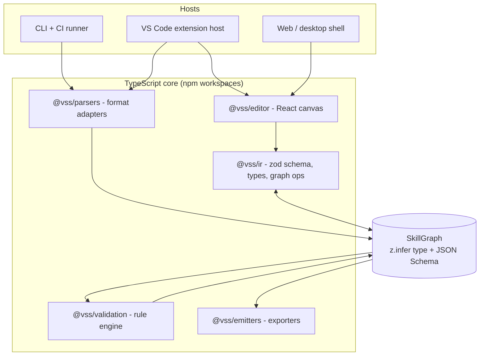

# Skill Insights - High-Level Implementation Plan

This plan turns [docs/specification.md](specification.md) into an engineering roadmap. It describes how the repository grows from the product definition into the portable parse → represent → visualize → validate → export system the specification defines.

## 1. Guiding Principles

- **IR first.** Every feature is expressed against the model-neutral skill graph. Nothing in the UI, CLI, or extension may depend on a provider file format directly.
- **One language, one core.** Everything - parsing, validation, export, canvas, CLI - is TypeScript. The extension host is Node.js and the canvas is React, so any second language would only add a process boundary and a schema to keep in sync.
- **Host-agnostic UI.** The React editor receives data through a host adapter interface, so the same bundle runs in a webview, browser, or desktop shell.
- **Browser-capable.** No native dependency and no child process, so the same code runs in desktop VS Code, vscode.dev, and github.dev.
- **Lossless round trip.** Import → edit → export must preserve unmodeled source content, so the tool is safe to run over existing skills.
- **Validation is data.** Findings are structured objects attached to graph node IDs, consumable by the UI, CLI exit codes, and chat.

## 2. Target Architecture



The extension imports the core directly as a library - no server process, no JSON-RPC, no interpreter discovery.

### Repository Layout (target)

```text
src/
  ir/                 zod schema, inferred types, graph ops, path safety
  parsers/            Per-provider importers (remark + yaml)
  validation/         Rule engine + rule packs
  emitters/           Per-provider exporters
  editor/             React canvas, inspector, diff, findings UI
  host/               Host adapter interface + web/vscode implementations
  extension/          VS Code extension host, webview, chat participant
  app/                Standalone web + desktop shell
  cli/                vss lint | graph | export | diff
  testing/            Test-only helpers, excluded from the build
fixtures/             Shared skill corpus + expected graphs
docs/
```

Each folder under `src/` is a layer, not an npm package. The dependency direction is
enforced by `src/architecture.test.ts` rather than by workspace boundaries.

## 3. The Intermediate Representation

The IR is the contract. Define it before any other work.

- **Node kinds:** `trigger`, `input`, `instruction`, `condition`, `action`, `toolCall`, `permission`, `validation`, `output`, `errorPath`, `reference`.
- **Edges:** typed and labeled (`then`, `else`, `onError`, `dataFlow`) to support both control flow and data lineage.
- **Provenance:** every node carries a `source` span (file URI, start/end line and column) — this is the single mechanism behind bidirectional navigation, diffing, and finding placement.
- **Capabilities:** tools, filesystem paths, network hosts, and secrets referenced by a node, normalized so permission analysis is provider-independent.
- **Extensions:** a `raw` bag preserving provider-specific fields that the IR does not model, enabling lossless export.
- **Versioning:** `schemaVersion` plus a migration chain. The zod schema is the single definition; static types come from `z.infer`, runtime validation from `.parse()`, and JSON Schema is generated for external consumers. There is no separate codegen step to keep in sync.

## 4. Workstreams

### W1 - IR and schema foundation
Author the zod schema, graph utilities (traversal, reachability, topological order, stable node IDs), migration harness, and round-trip fixtures. Everything else depends on this.

### W2 - Parsing and normalization
Adapter interface `detect(file) → parse(file) → SkillGraph`. First adapter targets the format already in the workspace: `SKILL.md` / `*.instructions.md` / `*.prompt.md` / `*.agent.md` with YAML frontmatter and Markdown bodies.

Built on **unified/remark** for Markdown and the **yaml** package for frontmatter. Both attach line/column positions to every node, which is what populates the IR `source` spans - the feature the entire navigation, diff, and findings story rests on.

Parsing is layered:
1. **Structural** — frontmatter, headings, code fences, file references.
2. **Semantic** — imperative steps, conditional language ("if the build fails…"), tool mentions matched against `allowed-tools`, output declarations.
3. **Assisted** — optional LLM pass that proposes nodes for ambiguous prose, always marked `confidence` and `inferred: true` so a human can confirm.

Discovery enumerates workspace, folder, and personal locations (`.github/`, `.copilot/`, `.agents/`, user prompts folder) with a documented precedence order.

### W3 - Validation engine
A rule registry where each rule is a pure function `SkillGraph → Finding[]`. Findings carry `severity`, `ruleId`, `nodeIds`, `message`, `sourceSpan`, and an optional structured `fix`. Rule packs mirror the specification:

| Pack | Rules |
| --- | --- |
| Structure | unreachable actions, missing inputs, circular flows, orphan nodes |
| References | broken file/skill/tool references, dangling links |
| Permissions | undeclared tool use, over-broad grants, destructive or network-reaching actions |
| Semantics | ambiguous or overlapping conditions, unhandled branches |
| Resilience | incomplete error-path coverage on fallible actions |
| Compatibility | constructs unsupported by a chosen target provider |

Fixes are emitted as IR patches, not text edits, so they apply identically from the UI, CLI, and chat.

### W4 - Visual editor (React)
Build an IR-driven canvas in `src/app`. Key pieces: automatic layered layout with manual override persisted in the IR, virtualized rendering for large graphs, node inspector bound to the IR schema, findings overlaid on nodes, and an editing model built on immutable graph operations with undo/redo.

Bidirectional navigation is a direct consequence of `source` spans: block selection reveals the span; editor cursor movement resolves to the innermost node.

### W5 - Host integration (VS Code)
Extension activates on skill file patterns, contributes an Activity Bar catalog and a central graph editor, and hosts the React bundle in a webview. The core is imported in-process, so parsing and validation are a function call rather than an RPC round trip. Findings are surfaced as VS Code diagnostics so they appear in the Problems panel as well as on blocks. A chat participant exposes explain, validate, and fix intents over the same IR. Keep the extension free of Node-only APIs where practical so the web extension host stays supported.

**Status: implemented.** The extension uses browser-compatible host bundles, schema-validated webview messages, strict CSP, diagnostics, source navigation, a dedicated Activity Bar catalog, a central side-by-side graph editor, live workspace and personal skill discovery, and the `@skillInsights` chat participant.

### W6 - Export and portability
Emitters invert the parsers. Export is validated by a round-trip property test: `parse(emit(graph)) ≈ graph`, with unmodeled content preserved via the `raw` bag. Compatibility checks run before export and report what a target provider cannot express.

### W7 - Diff and review
Structural graph diff (added, removed, moved, changed nodes and edges) rendered side by side, plus a text summary suitable for pull request comments and a CLI mode for CI.

### W8 - CLI and CI
`vss lint`, `vss graph`, `vss export`, `vss diff`, published as a single npm package and runnable via `npx`. Machine-readable JSON and SARIF output, non-zero exit on configured severity, and a reference GitHub Action.

## 5. Delivery Phases

| Phase | Goal | Exit criteria |
| --- | --- | --- |
| P0 - Foundation | Monorepo, schema, CI, fixture corpus | zod schema published with inferred types and generated JSON Schema; round-trip fixture harness green |
| P1 - Read-only insight | Parse real skills and view them | Prototype replaced by IR-driven canvas; the fixture corpus and this workspace's own skills render from parsed source; bidirectional navigation works |
| P2 - Trust | Validation surfaces in every host | Six rule packs implemented; findings render on blocks, in Problems panel, and via `vss lint` |
| P3 - Authoring | Edit visually, write back | Node/edge editing with undo; export preserves unmodeled content; round-trip test enforced in CI |
| P4 - Portability | Model-agnostic | Two additional provider adapters; compatibility checks gate export |
| P5 - Collaboration | Review workflows | Visual diff, chat-assisted explanation and fixes, CI action published |

## 6. Cross-Cutting Concerns

- **Security.** Parsed skill content is untrusted input: never execute referenced scripts during analysis, sandbox the webview with a strict CSP, treat file references as potential path traversal, and redact secrets before any content reaches an LLM. Flag prompt-injection patterns in skill text as findings.
- **Performance.** Target interactive response on workspaces with hundreds of skill files: incremental reparse on save, cached graphs keyed by content hash, virtualized canvas. If validation ever becomes CPU-bound, move it to a worker thread before considering a native rewrite.
- **Testing.** Vitest throughout: golden-file tests per parser, unit tests per validation rule, property-based round-trip tests, and Playwright end-to-end runs against the browser host.
- **Telemetry and privacy.** Opt-in, aggregate only; skill content never leaves the machine unless the user invokes an explicit AI action.

## 7. Key Risks

| Risk | Mitigation |
| --- | --- |
| Natural-language skills resist deterministic parsing | Layered parser; mark inferred nodes with confidence; never silently rewrite prose the parser did not understand |
| Export loses fidelity | `raw` extension bag plus enforced round-trip property tests |
| Provider formats drift | Adapters isolated behind one interface; conformance fixture suite per provider |
| Assisted parsing needs real NLP later | Keep the third parser tier behind an interface so a specialist service can be added without touching the core |
| Graph becomes unreadable at scale | Grouping, collapsing, focus mode, and search built into the canvas from P1 |

## 8. Immediate Next Steps

1. Define the `SkillGraph` zod schema in `src/ir` and validate it against a hand-authored graph for a sample skill.
2. Stand up the npm workspaces monorepo with build, lint, and test wired into CI.
3. Build the first remark-based parser against this workspace's own skill and instruction files, since they are a realistic corpus.
4. Render a `SkillGraph` in the React editor rather than an inline `nodes` array — the smallest change that proves the IR is sufficient for the UI.
