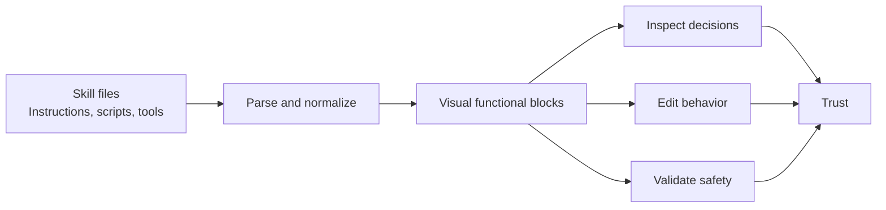
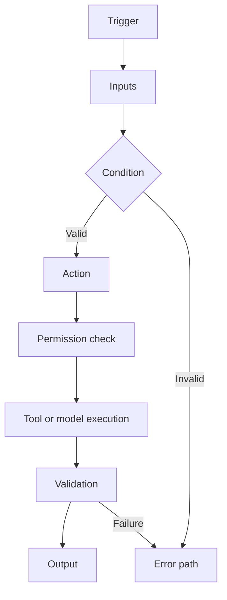
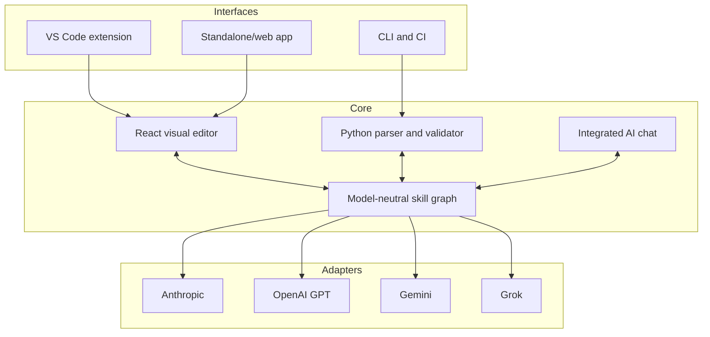
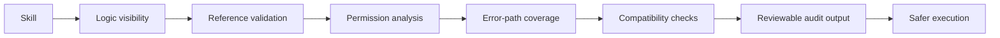

# Skill Insights

## Product Description

AI skills extend coding assistants with specialized instructions, workflows, tools, and decision logic. They are powerful, but their behavior is often hidden inside long text files, nested conditions, scripts, and external references. This makes skills difficult to understand, review, validate, and trust.

Skill Insights transforms AI skills into an interactive visual representation of their functional and actionable logic. Developers and engineers can immediately see what triggers a skill, which decisions it makes, what tools it invokes, what data it accesses, and what outcomes it produces.

The tool operates inside Visual Studio Code or as a standalone application. Existing skill definitions are parsed into connected functional blocks representing triggers, instructions, conditions, actions, tool calls, validations, outputs, and error paths. Selecting a block reveals the corresponding source, while selecting source code highlights the matching block.

Skill Insights is also an authoring environment. Users can create or modify skills by connecting visual blocks, editing their properties, and generating the corresponding portable skill definition. Changes remain synchronized between the visual model and source representation.

Built-in validation identifies unreachable actions, missing inputs, broken references, unsafe tool permissions, ambiguous conditions, circular flows, incomplete error handling, and incompatible model-specific constructs. Validation results appear directly on the affected blocks and can be discussed or corrected through the integrated VS Code chat.

The system is model-agnostic. A shared intermediate representation separates skill intent from provider-specific formats, enabling import, visualization, validation, and export for Anthropic, OpenAI GPT, Google Gemini, Grok, and future skill ecosystems.

All core functionality is implemented using portable React and Python components or reusable libraries. This allows the same parsing, visualization, validation, and transformation engine to run as a VS Code extension, desktop application, web application, command-line utility, or CI validation step.

### Core Capabilities

- Integrate with VS Code chat for explanation and assisted editing.
- Enumerate VSCode workspace or folder for existing skill and instruction files including personal ones.
- Visualize hidden control flow and tool execution.
- Trace triggers, conditions, actions, outputs, and failure paths.
- Navigate bidirectionally between blocks and source.
- Validate structure, references, permissions, and compatibility.
- Compare skill versions using visual diffs.
- Highlight sensitive, destructive, or externally connected actions.

### Block Inspector Markdown Actions

The Detail field exposes two icon actions. **MD preview** opens a modal dialog that
occupies at least 60% of the viewport's width and height and renders the selected
block's Markdown detail using basic headings, paragraphs, lists, links, emphasis, and
code formatting, plus GitHub-style tables, task lists, strikethrough, and autolinks.
Raw HTML remains disabled. The dialog closes from its close button or Escape and
returns focus to the preview action. **MD** opens the backing skill file in the regular
VS Code text editor, moves the cursor to the selected block's start, and selects its
source span. Both actions have accessible names and remain keyboard operable.

The standalone web debugger opens with a committed complex skill fixture. The fixture
exercises large graph grouping, branches, tools, references, failures, and rich Markdown
so the browser preview provides deterministic coverage without personal skill files.

### Primary Value

Skill Insights turns opaque AI automation into inspectable engineering artifacts. It helps teams review skills as quickly as architecture diagrams, understand execution before enabling a skill, and apply familiar software-engineering controls to AI behavior.

The result is greater transparency, safer adoption, faster authoring, easier collaboration, and less dependence on any single AI model or development environment.

## Infographic: From Hidden Logic to Visible Flow

## Infographic: Functional Block Model

## Infographic: Portable Architecture

## Infographic: Trust and Safety Layers

